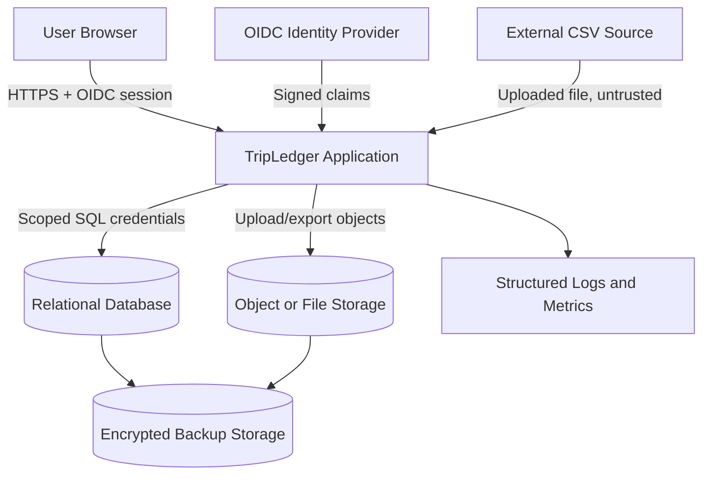

# TripLedger Security Design

**Stage:** 4 - Domain Modeling and Architecture  
**Date:** 13 July 2026  
**Version:** 0.1  
**Status:** Security baseline for validation release

## 1. Security Objective

TripLedger must prevent unauthorised users, compromised accounts, malformed imports, software defects, or operator mistakes from:

- seeing another organisation's data;
- changing financial records without evidence;
- using the same financial amount more than once;
- hiding or altering audit evidence;
- exporting restricted data;
- silently accepting incorrect reconciliation.

## 2. Data Classification

| Class | Examples | Controls |
|---|---|---|
| Public | Documentation and sample templates | No special restriction |
| Internal | Source names, rule settings, operational metrics | Authenticated access |
| Confidential | Booking amounts, supplier costs, margins, reconciliation results | Organisation isolation, role checks, encrypted transport, audit |
| Restricted | Secrets, MFA material, backup keys, provider credentials | External secret management, no logs, no source control |
| Prohibited in MVP | Raw card number, CVV, passport scans, medical records, bank credentials | Reject or remove before processing |

## 3. Trust Boundaries

All user input, source files, identity claims, and future connector data are untrusted until validated by TripLedger.

## 4. Authentication

Decision:

- Use OIDC identity provider.
- TripLedger does not store passwords or MFA secrets.

Required token/session controls:

- Validate issuer, audience, signature, expiry, and relevant MFA claim.
- Map identity subject to one active TripLedger user.
- Check user status on every protected request or token-policy boundary.
- Session inactivity maximum: 30 minutes.
- Absolute session maximum: 12 hours unless identity provider is stricter.
- Financial exports require recent authentication no older than 15 minutes.

## 5. Authorisation

Authorisation uses both role and organisation context.

Roles:

- `ADMINISTRATOR`
- `FINANCE`
- `OPERATIONS`
- `READ_ONLY_MANAGER`

Rules:

- Deny by default.
- UI hiding is never sufficient.
- Every query and command is scoped by `organisation_id`.
- Direct object access by id still checks organisation ownership.
- Cross-organisation access returns no protected data and must not reveal whether the target object exists.
- Administrator and Finance financial functions require MFA.

High-risk operations requiring audit:

- failed login or protected denial;
- role change;
- user deactivation;
- import;
- financial event reversal;
- manual match or unmatch;
- adjustment;
- accepted variance;
- export;
- settings change.

## 6. Tenant Isolation Controls

Defence in depth:

1. `ActorContext.organisationId` required for protected operations.
2. Repository queries require organisation predicates.
3. Database tables include `organisation_id`.
4. Composite foreign keys include organisation where practical.
5. Cache keys include organisation id.
6. Export filters are organisation-scoped.
7. Background jobs store and enforce organisation id.
8. Automated negative tests cover guessed ids and cross-org references.

## 7. Import Security

CSV imports are the main untrusted data boundary.

Controls:

- CSV only in MVP.
- Maximum file size: 25 MB.
- Maximum rows: 100,000 data rows.
- Validate declared and detected format.
- Reject unsupported template version before domain writes.
- Use streaming parser with bounded row and field sizes.
- Store uploaded files outside executable paths.
- Do not log raw rows or full payloads.
- Reject prohibited fields where templates can detect them.
- Preserve row-level results for accepted, duplicate, rejected, and warning outcomes.
- Treat parser or file-level security failures as failed batch with no domain writes.

## 8. Financial Integrity Controls

- Use exact decimal money and currency precision validation.
- Require exchange-rate evidence for every conversion.
- Accepted financial events are immutable.
- Corrections use reversal/replacement or controlled adjustment.
- Matching is deterministic and auto-creates only unique valid matches.
- Manual match/unmatch requires Finance/Admin authority, MFA, reason, and audit.
- Allocation writes use a database transaction and row lock on affected financial event.
- Reconciliation snapshots store rule version.
- Missing required data is `UNKNOWN`, not zero.

## 9. Audit and Timeline Controls

Audit events include:

- organisation;
- actor or system identity;
- action;
- target type and id;
- timestamp;
- correlation id;
- outcome;
- material before/after references;
- reason where required.

Controls:

- Audit events are append-only through normal application paths.
- Normal users cannot edit or delete audit events.
- Financial actions and their audit record should commit atomically where practical.
- A material financial action without audit is a release-blocking defect.

## 10. Export Security

Controls:

- Finance/Admin role required for financial exports.
- Recent authentication required.
- Export scope checked against organisation and role.
- Include only fields required by selected export purpose.
- Neutralise spreadsheet formula-leading cells beginning with `=`, `+`, `-`, `@`, tab, or carriage return.
- Record format version, filters, row count, checksum, actor, and generation time.
- Store generated files outside executable paths.

## 11. Logging and Observability Security

Logs include:

- correlation id;
- organisation id;
- operation;
- outcome;
- duration;
- stable error category.

Logs exclude:

- source file payloads;
- full customer contact details;
- secrets;
- tokens;
- credentials;
- raw financial account data.

## 12. Backup Security

Controls:

- Encrypted backup storage.
- Backup credentials separate from normal application access.
- Backup manifest includes timestamp, schema version, row counts, and checksum.
- Restore rehearsal before real-data pilot.
- Access to backup storage is logged and restricted.

## 13. Secure Delivery Controls

Pipeline must run:

- automated tests;
- cross-role and cross-organisation API tests;
- business-rule tests;
- dependency scan;
- secret scan;
- container or package scan when applicable;
- migration verification;
- deployment health verification.

Critical unresolved findings block release.

## 14. Security Verification Gate

Before real data:

- [ ] MFA verified for Administrator and Finance financial workflows.
- [ ] Cross-role and cross-organisation tests pass.
- [ ] CSV parser limits and malformed-file tests pass.
- [ ] No restricted data in logs, errors, fixtures, repository, or exports.
- [ ] Allocation concurrency test passes on selected production database.
- [ ] Audit completeness tests pass for material financial actions.
- [ ] Backup encryption and restore rehearsal verified.
- [ ] Data-flow, retention, controller/processor, and hosting review completed.
- [ ] Independent security review completed for pilot release.
