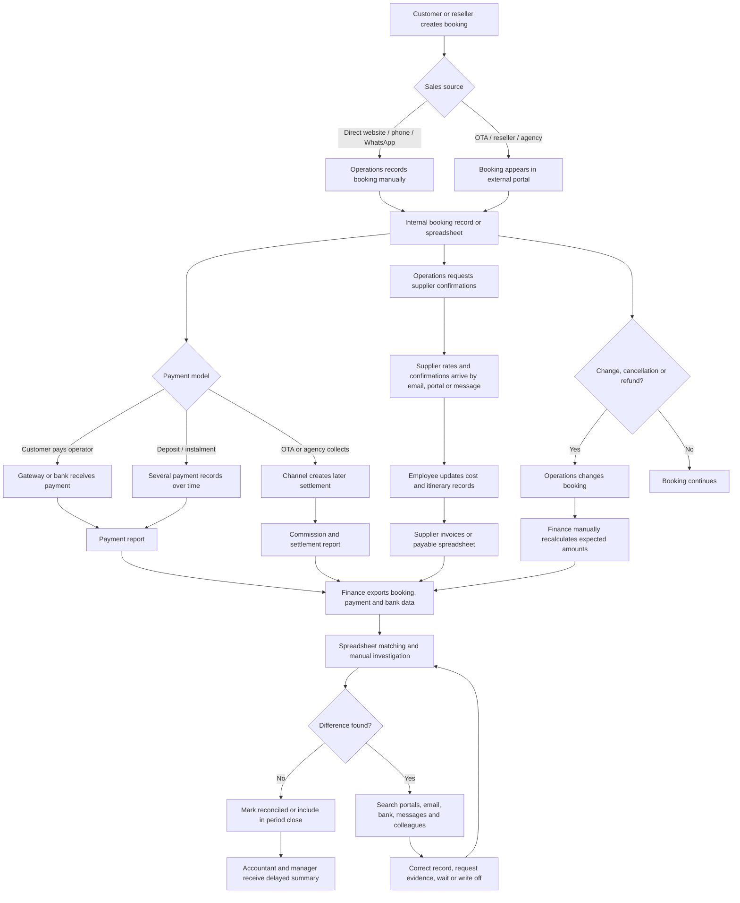
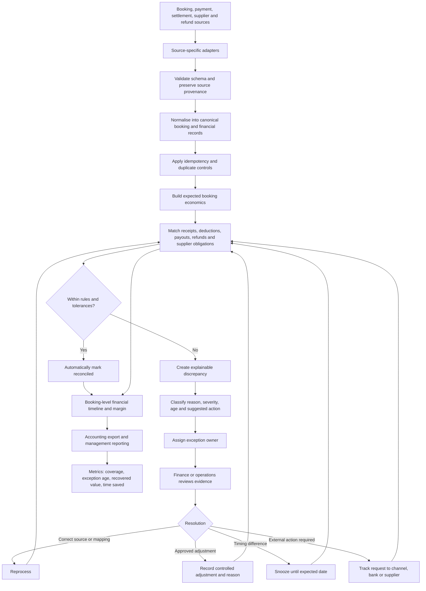

# Stage 1 — Discovery and Validation

**Product:** TripLedger  
**Document:** Discovery and Validation Report  
**Owner:** Ali Emre GÜŞLÜ  
**Date:** 13 July 2026  
**Version:** 0.1  
**Status:** Evidence-backed discovery baseline; direct-user validation remains open

---

## 1. Purpose

This stage tests the central TripLedger assumption before detailed requirements or architecture are fixed:

> Small and medium-sized tourism operators lose time, financial visibility, and control because booking, payment, commission, refund, supplier, and accounting information is spread across systems that do not produce one explainable booking-level financial result.

The purpose is not to prove that no competing product exists. Existing products clearly provide booking, channel, payment, reporting, and reconciliation capabilities. The purpose is to determine:

1. Which user workflow remains costly or unreliable.
2. Which user segment experiences the problem most strongly.
3. Whether TripLedger can improve that workflow without replacing every existing operational system.
4. Which outcomes should be measured in a pilot.
5. Which assumptions still require interviews and real sample data.

---

## 2. Discovery Method

This discovery package uses four evidence types:

| Evidence type | What it contributes | Limitation |
|---|---|---|
| Stage 0 project brief | Initial problem, scope, constraints, and product hypothesis | Contains assumptions created before discovery |
| Public industry research | Evidence of fragmented systems, digitalisation gaps, interoperability needs, and reconciliation pressure | Usually sector-wide and not specific to one Turkish operator |
| Existing-solution review | Shows what mature products already solve and prevents reinventing common features | Vendor material describes strengths and may not disclose limitations |
| Representative workflow scenario | Makes the end-to-end process concrete enough to expose hand-offs, risks, and data needs | Must be confirmed against real users and records |

### Evidence-strength labels

- **Supported:** Directly supported by multiple public sources or an official product capability.
- **Plausible:** Consistent with available evidence but requires direct user confirmation.
- **Unvalidated:** A product or market assumption that cannot yet be treated as fact.

---

## 3. Public Evidence Summary

### 3.1 Fragmented payment and operational systems are a documented problem

Adyen reports that 68% of hospitality and travel businesses see fragmented payment systems as an operational challenge; 77% agree that fragmented online and on-site payments make reconciliation inefficient, and 82% associate the fragmentation with increased security risk.[^adyen-trends] Adyen also describes the burden created by multiple vendors, cross-border fees, delayed refunds, and time-consuming administration.[^adyen-index]

**Discovery implication:** Reconciliation and integration are legitimate sector problems. We should not frame them as personal preference.

### 3.2 Tourism SMEs face a digital-capability and data-integration gap

The European Commission's 2025 tourism consultation synthesis identifies a digital divide between large, technology-driven tourism platforms and smaller tourism businesses. It reports uneven adoption of advanced technology, limited capacity among smaller operators, and stakeholder demand for data standardisation, interoperability, cross-border collection, and reduced data silos.[^eu-annex][^eu-report]

**Discovery implication:** The target solution must remain usable and affordable for organisations without an internal software team. Complex implementation and extensive training would destroy much of the intended value.

### 3.3 Travel interoperability remains structurally difficult

OpenTravel explicitly identifies API costs and barriers to interoperability as travel-industry problems and promotes shared message standards, reference architectures, and modern API implementations.[^opentravel]

**Discovery implication:** The connector and normalisation layer is a core product capability, not incidental technical plumbing.

### 3.4 Reconciliation is already a competitive product category

Mews publicly positions automated matching of card, wire, online, and virtual-card payments to hotel bookings, with daily reconciliation and payout reporting.[^mews] Cloudbeds provides a payment reconciliation report intended to compare recorded income with actual payments and identify discrepancies.[^cloudbeds]

**Discovery implication:** “Automated payment reconciliation for hotels” by itself is not a sufficiently differentiated product claim.

### 3.5 Tour-operator software already covers significant workflow areas

Bókun positions itself as an all-in-one tour-operator platform covering booking, availability, channel management, marketplace partnerships, product resources, CRM, reporting, and back-office tools.[^bokun] FareHarbor similarly combines booking, payments, waivers, reporting, and marketing for tours and attractions.[^fareharbor] Tourwriter supports supplier invoices, multi-currency handling, Stripe payments, and two-way Xero accounting synchronisation.[^tourwriter]

**Discovery implication:** TripLedger must not compete as another general booking engine. Its proposed gap must be narrower: provider-neutral financial control and explainable reconciliation across systems already in use.

---

## 4. Refined Beachhead Segment

### 4.1 Initial segment

The first discovery segment is refined to:

> **Small and medium-sized inbound tour operators and destination-management companies in Türkiye that construct multi-supplier bookings and receive sales from more than one channel.**

### 4.2 Representative qualification criteria

A suitable first customer probably has most of these characteristics:

- Approximately 50–1,000 bookings per month.
- At least two sales sources, such as direct sales, an OTA, an agency, or a reseller.
- At least two supplier categories, such as accommodation, transfer, guide, activity, or restaurant.
- Customer payments and supplier obligations in more than one currency.
- Deposits, instalments, refunds, or cancellations.
- Reconciliation performed partly in spreadsheets or by comparing exported reports.
- No dedicated internal engineering team.
- A finance or operations employee who can explain the booking lifecycle.

These thresholds are **representative assumptions**, not validated market boundaries.

### 4.3 Why this segment is preferred over hotels for the first version

Hotel-focused platforms such as Mews, Cloudbeds, and SiteMinder already provide strong combinations of PMS, distribution, embedded payments, reporting, and hotel reconciliation.[^mews][^cloudbeds][^siteminder] Tour operators and DMCs, however, often combine multiple services, suppliers, channels, payment schedules, currencies, and cancellation rules in one customer booking.

The working differentiation is therefore:

> TripLedger does not replace the booking or accounting system. It creates an independent, explainable booking-level control record across booking sources, payment records, channel deductions, supplier obligations, refunds, and accounting exports.

This differentiation is **plausible but not yet proven commercially**.

---

## 5. Representative Personas

These personas represent roles, not fictional market claims. They must be corrected after interviews.

## Persona A — Finance and Reconciliation Specialist

**Representative name:** Elif  
**Organisation:** Inbound tour operator or DMC  
**Primary goal:** Close each period with confidence that customer receipts, commissions, supplier costs, refunds, and settlements are complete and correct.

### Jobs to be done

- Determine whether every confirmed booking has the expected payment.
- Compare booking-system values with gateway, bank, OTA, or agency statements.
- Calculate or verify commission deductions.
- Track supplier invoices and payable amounts.
- Investigate unmatched or short-paid transactions.
- Prepare records for the accountant and management.

### Current frustrations

- Booking identifiers differ between systems.
- One booking may contain several suppliers and currencies.
- Refunds and cancellations alter the original expected amounts.
- Reports use different dates: booking date, transaction date, service date, payout date, and invoice date.
- Manual spreadsheet formulas are difficult to audit.
- The same exception may be investigated more than once.

### Risk if the job fails

- Revenue leakage.
- Incorrect supplier payment.
- Duplicate refund or payment.
- Delayed month-end close.
- Unexplained accounting differences.
- Loss of management trust.

### Required product outcome

A review queue showing which bookings reconcile, which do not, why they do not, the source evidence, and the next action.

---

## Persona B — Reservations and Operations Coordinator

**Representative name:** Mert  
**Organisation:** Inbound tour operator  
**Primary goal:** Deliver the booked services correctly while knowing whether payment or supplier issues block fulfilment.

### Jobs to be done

- Confirm itinerary and service dates.
- Reserve hotels, transfers, guides, and activities.
- Track supplier confirmation.
- Update cancellations and changes.
- Communicate exceptions to finance and sales.
- Check whether the customer has paid enough to continue fulfilment.

### Current frustrations

- Financial status is held by another employee or spreadsheet.
- Supplier changes do not always update the commercial calculation.
- Last-minute service changes produce unrecorded cost differences.
- Payment, booking, and operations statuses are confused.
- Important context is buried in email or messaging applications.

### Risk if the job fails

- Service delivered without adequate payment.
- Supplier not confirmed or paid.
- Customer receives an outdated itinerary.
- Margin is reduced without management visibility.
- Finance reconciles an obsolete booking version.

### Required product outcome

A single booking timeline that separates operational status from financial status and records material changes.

---

## Persona C — Owner or General Manager

**Representative name:** Zeynep  
**Organisation:** Small or medium-sized DMC  
**Primary goal:** Know whether the company is earning the expected margin and whether unresolved financial issues are under control.

### Jobs to be done

- Review total sales, expected margin, and supplier liabilities.
- Identify high-risk or overdue discrepancies.
- Understand which sales channels are profitable.
- Verify that refunds and write-offs are controlled.
- Reduce dependence on a single experienced employee.

### Current frustrations

- Reports arrive after problems have already aged.
- Gross sales are visible, but real margin is unclear.
- The reason for a discrepancy is difficult to reconstruct.
- The business cannot easily distinguish data error, timing difference, operational change, and actual loss.

### Risk if the job fails

- Poor cash-flow decisions.
- Hidden margin leakage.
- Fraud or unauthorised adjustment.
- Business growth increases administrative cost disproportionately.

### Required product outcome

A concise management view with traceable figures, material exceptions, age, owner, and resolution status.

---

## Persona D — External Accountant

**Representative name:** Can  
**Organisation:** External accounting firm  
**Primary goal:** Receive consistent, supportable financial records without reconstructing tourism operations.

### Jobs to be done

- Import or review sales, fees, refunds, and supplier documents.
- Confirm that transaction references and dates are consistent.
- Ask the operator for missing evidence.
- Map operational transactions into accounting categories.

### Current frustrations

- Operational and accounting terminology differ.
- The same booking appears under several identifiers.
- Adjustments are communicated informally.
- Supporting documents are disconnected from the final amount.

### Required product outcome

An export with stable identifiers, source references, adjustment reasons, and links to supporting records.

---

## 6. Representative Current-State Workflow

### 6.1 Workflow trigger

A customer or reseller creates a booking containing one or more tourism services.

### 6.2 Current-state map

See [`CURRENT_STATE_WORKFLOW.mmd`](./CURRENT_STATE_WORKFLOW.mmd) for the standalone Mermaid source.

### 6.3 Step-by-step current workflow

| Step | Actor | Data or tool | Hand-off | Typical delay | Failure mode |
|---|---|---|---|---|---|
| 1. Booking capture | Sales or operations | OTA portal, website, phone, email, WhatsApp | Sales → operations | Minutes to one day | Missing or duplicated booking |
| 2. Internal registration | Operations | Booking tool or spreadsheet | Operations → finance | Immediate to several days | Source identifier lost or changed |
| 3. Supplier reservation | Operations | Email, supplier portal, phone, message | Operator ↔ supplier | Hours to days | Price or status differs from internal record |
| 4. Customer payment | Customer, channel, or operator | Gateway, virtual card, bank, cash | Payment source → finance | Immediate to several days | Partial, duplicate, delayed, or unidentified payment |
| 5. Commission or channel deduction | OTA, agency, or reseller | Settlement report | Channel → finance | Days to weeks | Unexpected fee or changed commission |
| 6. Change or cancellation | Customer, operations, supplier | Booking record, messages, policy documents | Operations → finance | Often delayed | Financial expectation not updated |
| 7. Supplier invoice or payable calculation | Supplier and finance | Invoice, contract, spreadsheet | Supplier → finance | Before or after service | Invoice amount differs from contracted or recorded cost |
| 8. Data export | Finance | CSV, Excel, PDF, bank statement | Systems → spreadsheet | Daily, weekly, or monthly | Different schemas, dates, currencies, and identifiers |
| 9. Reconciliation | Finance | Spreadsheet and portals | Finance ↔ operations | Minutes to hours per exception | Incorrect formula, missed record, repeated investigation |
| 10. Exception resolution | Finance, operations, channel, supplier | Email, portal, messages | Multiple hand-offs | Days or weeks | No owner, no evidence, no ageing control |
| 11. Accounting hand-off | Finance | Export and documents | Operator → accountant | Periodic | Unsupported or inconsistent adjustment |
| 12. Management reporting | Finance or owner | Spreadsheet summary | Finance → management | Often after period end | Gross sales mistaken for realised margin |

---

## 7. Current-State Data Map

| Data object | Common origin | Why it is difficult |
|---|---|---|
| Booking | OTA, website, agency, manual entry | Different identifiers and status vocabularies |
| Booking item | Hotel, activity, transfer, guide, meal | One booking may contain many suppliers and service dates |
| Customer payment | Gateway, bank, cash, OTA collect | Payment may be split, delayed, converted, or batched |
| Channel commission | OTA or agency contract and report | Percentage, fixed, tax, promotion, or adjustment rules vary |
| Settlement | OTA, gateway, bank | One payout may cover many bookings and fees |
| Supplier obligation | Contract, confirmation, invoice | Cost may change after booking or service |
| Refund | Gateway, channel, bank | Operational cancellation and financial refund occur at different times |
| Exchange rate | Gateway, bank, operator policy | Booking, payment, settlement, and accounting rates may differ |
| Supporting evidence | PDF, email, message, portal | Usually not linked to the calculated result |
| Accounting entry | Accounting software | Uses accounting periods and categories not identical to booking operations |

---

## 8. Critical Pain Points

| Pain point | Evidence level | Severity | Why it matters |
|---|---|---:|---|
| No single booking-level financial truth | Supported sector-wide; local workflow unvalidated | Critical | Users cannot answer what was earned, paid, owed, or refunded without reconstruction |
| Identifier and schema inconsistency | Supported by interoperability evidence | Critical | Automated matching fails without provenance and normalisation |
| Multi-supplier cost changes are disconnected from sales values | Plausible | High | Margin changes silently after operational amendments |
| Commission and settlement deductions are difficult to explain | Supported as a fragmented-payment problem | High | Short payments may be accepted or investigated repeatedly |
| Partial payments, refunds, and cancellations alter expectations over time | Supported by existing product capabilities; local frequency unvalidated | High | A static booking total is not a sufficient financial model |
| Manual spreadsheet reconciliation | Supported by industry and vendor positioning | High | Slow, error-prone, and dependent on individual knowledge |
| Exceptions have no explicit owner, reason, age, or evidence trail | Plausible | High | Problems remain unresolved or are rediscovered |
| Accounting and operations use different dates and concepts | Supported by official reconciliation documentation; local details unvalidated | High | Period totals differ even when transactions are legitimate |
| Small operators have limited digital and implementation capacity | Supported | High | A complex product will fail adoption even when technically capable |
| Existing systems already solve broad booking or hotel operations | Supported | Strategic | TripLedger must integrate with them instead of rebuilding them |

---

## 9. Failure-Mode Catalogue

| Failure mode | Example | Detection signal | Consequence |
|---|---|---|---|
| Missing payment | Booking confirmed but no receipt by due date | Expected amount exceeds received amount after tolerance | Cash-flow and fulfilment risk |
| Short settlement | OTA payout lower than expected | Settlement allocation plus deductions does not equal expectation | Margin leakage or unexplained fee |
| Duplicate import | Same booking or payment imported twice | Same source and source identifier repeated | Inflated revenue or payment balance |
| Unmatched payment | Bank receipt has no recognised booking reference | Payment exists without matching candidate | Manual investigation and customer confusion |
| Wrong commission | Contract expects 15%, statement applies another amount | Calculated fee differs from imported fee | Revenue leakage |
| Supplier overcharge | Invoice exceeds confirmed booking cost | Invoiced supplier amount above approved obligation | Incorrect payable |
| Supplier under-recording | Service added operationally but not financially | Confirmed service has no obligation | Understated cost and margin |
| Refund not reflected | Customer refunded, booking still shows paid | Refund event exists but expectation unchanged | Incorrect customer and accounting balance |
| Cancellation fee omitted | Booking cancelled but policy charge missing | Cancellation state without expected retained amount | Lost revenue |
| Exchange-rate variance | Collection and supplier payments use different rates | Base-currency amounts diverge outside tolerance | Margin volatility |
| Timing difference | Payout belongs to a later statement period | Amount matches but dates fall outside expected window | False positive discrepancy |
| Unauthorised adjustment | User changes amount without approved reason | Material manual change lacks authorisation/evidence | Fraud and audit risk |
| Stale source data | OTA change not reflected internally | Source version or update time newer than local state | Wrong service or financial decision |
| Ambiguous source of truth | Same invoice edited in two systems | Conflicting versions with no ownership rule | Repeated corrections and inconsistency |

---

## 10. Existing-Solution Comparison

This is a capability-positioning comparison based on public product material, not a procurement-grade feature audit.

| Solution category / example | Publicly emphasised strengths | What this means for TripLedger |
|---|---|---|
| Hotel operating system — Mews | PMS, embedded payments, automatic booking-payment matching, ledgers, daily reconciliation and payout reporting | Do not target “hotel payment matching” as an original standalone claim |
| Hotel platform — Cloudbeds | PMS, reporting, payment reconciliation, transaction detail, reversals and accounting-oriented records | Hotel-native reconciliation is already served inside broader platforms |
| Hotel distribution — SiteMinder | OTA connectivity, real-time inventory, reservations, integrated payments and channel reporting | Distribution and overbooking prevention are outside the first-version differentiation |
| Tour booking platform — Bókun | Booking, availability, channel management, marketplace, CRM, resources, reporting and back-office tools | Do not rebuild a general tour booking engine |
| Tour booking platform — FareHarbor | Booking, payments, waivers, reporting, marketing, inventory and operator workflows | Generic operational consolidation is crowded |
| Tour distribution — Rezdy | Reseller/agent relationships, channel management, commissions, agreements and payment models | Agent and commission handling is an established capability |
| Tour/DMC operations — Tourwriter | Itinerary and supplier operations, payments, multi-currency, Xero integration and supplier reconciliation | Supplier and accounting connectivity is commercially important and already addressed in some suites |

### 10.1 Proposed gap hypothesis

The proposed gap is not “existing products cannot reconcile.” They can.

The proposed gap is:

> Some small and medium-sized multi-supplier operators may need a provider-neutral financial control layer that can sit beside their existing booking, payment, bank, supplier, and accounting tools; preserve source provenance; calculate expected booking economics; explain mismatches; and manage exceptions without requiring a complete platform migration.

### 10.2 What must be validated

We must ask users:

1. Do they already receive this outcome from their current platform?
2. If not, why have existing reports or integrations failed?
3. Is the missing capability primarily integration, data quality, business rules, usability, or implementation support?
4. Would they adopt a separate control layer?
5. Which systems must be connected first?
6. Is saved time or recovered revenue large enough to justify payment?

Until those questions are answered, the gap remains a **testable hypothesis**, not a market fact.

---

## 11. Proposed Future-State Workflow

See [`FUTURE_STATE_WORKFLOW.mmd`](./FUTURE_STATE_WORKFLOW.mmd) for the standalone Mermaid source.

### 11.1 Future workflow changes

| Current state | Future state | Intended outcome |
|---|---|---|
| Separate exports with lost context | Source adapters preserve provider and record identity | Every value remains traceable |
| Spreadsheet formulas reconstruct expectations | Explicit booking-economics rules calculate expected amounts | Calculation becomes repeatable and testable |
| Manual line-by-line comparison | Matching engine proposes or confirms relationships | Routine records require no investigation |
| All differences appear equally | Discrepancies are classified by reason, age, value, and severity | Staff focus on material exceptions |
| Evidence stored in portals and messages | Records and evidence references appear on one timeline | Faster, auditable investigation |
| Adjustments overwrite history | Controlled adjustment creates an immutable event | Auditability and accountability |
| Exceptions live in personal notes | Queue assigns owner, status, deadline, and resolution | Problems are actively managed |
| Period reports are prepared after investigation | Reconciled and unresolved totals update continuously | Earlier visibility and faster close |
| Manager sees gross totals | Manager sees realised, expected, payable, and unresolved values | Better margin and cash-flow decisions |

---

## 12. Validated Problem Statement

### 12.1 Evidence-backed wording

> Small and medium-sized tourism businesses often operate across booking, payment, distribution, supplier, and accounting systems whose data is fragmented and difficult to standardise. This fragmentation makes reconciliation slower and less reliable and can increase manual work, delayed refunds, security exposure, and difficulty explaining financial outcomes. Existing hotel and tour-operator platforms solve substantial parts of the workflow, but it remains plausible that multi-supplier operators using several systems need a provider-neutral control layer for booking-level economics and exception management.

### 12.2 User-specific wording awaiting direct validation

> Inbound tour operators and DMCs in Türkiye that manage multi-supplier, multi-channel, and multi-currency bookings spend significant staff time reconciling bookings, customer receipts, channel deductions, supplier obligations, settlements, and refunds. Their current tools do not consistently provide one explainable, auditable booking-level financial result.

The first paragraph is supported by public evidence. The second paragraph is the working local-market problem statement and must be confirmed through interviews and sample records.

---

## 13. Success Measures and Proxy Measures

### 13.1 Discovery measures

| Measure | Minimum discovery evidence | Why |
|---|---:|---|
| User interviews | 5 interviews across at least 3 organisations | Prevent one person's workflow becoming the whole product |
| Finance-role coverage | At least 2 finance/reconciliation users | Primary pain must be observed directly |
| Operations-role coverage | At least 2 reservations/operations users | Financial and operational hand-offs must both be understood |
| Owner/manager coverage | At least 1 decision-maker | Validate business value and willingness to change |
| Workflow samples | At least 2 end-to-end anonymised booking cases | Verify actual identifiers, dates, currencies, and documents |
| Exception samples | At least 10 real or carefully anonymised discrepancies | Build a credible failure-mode catalogue |
| Existing-tool inventory | Record every system and spreadsheet used by interviewees | Determine integration priorities |
| Baseline time | Measure or estimate time spent per record and per period | Needed to prove improvement |
| Problem frequency | Count records requiring manual intervention | Determines addressable workload |
| Problem cost | Estimate staff time, delayed cash, write-offs, or leakage | Determines commercial value |

### 13.2 Product pilot measures

| Measure | Baseline | First pilot target | Measurement method |
|---|---|---:|---|
| Automatic reconciliation coverage | To be measured | ≥ 80% initially; stretch target 90% | Eligible records automatically reconciled / total eligible records |
| False reconciliation rate | Unknown | 0 material false positives in accepted pilot sample | Independent review of auto-reconciled records |
| Material discrepancy recall | Unknown | 100% in controlled acceptance set | Seed known exceptions and verify detection |
| Median investigation time | To be measured | Reduce by ≥ 50% | Time from opening exception to decision |
| Period-close preparation time | To be measured | Reduce by ≥ 40% | Compare same workflow before and after pilot |
| Unresolved exception age | Unknown | 90% of material exceptions assigned within 1 business day | Queue timestamps |
| Duplicate-import defects | Existing rate unknown | 0 in acceptance and pilot reruns | Repeat imports and verify idempotency |
| Explainability success | Manual reconstruction | Reviewer can trace 100% of displayed amounts | Evidence-link and calculation review |
| User confidence | To be measured | Average ≥ 4/5 among pilot users | Post-task rating |
| Commercial value proxy | Unknown | Time saved or recovered value exceeds indicative subscription | Pilot benefit calculation |

### 13.3 Guardrail measures

- No raw card data stored.
- No silent record rejection.
- No manual financial adjustment without actor, time, reason, and original value.
- No automatic reconciliation when confidence or invariant checks are below the approved threshold.
- No architectural expansion justified solely by projected scale.

---

## 14. Discovery Decisions

### Decision 1 — Focus on reconciliation and financial control

**Decision:** Retain the reconciliation-first product hypothesis.

**Why:** Public research supports fragmented systems and reconciliation pressure. However, the outcome must include supplier obligations and explainability, not just customer payment matching.

### Decision 2 — Narrow the first segment

**Decision:** Prioritise inbound tour operators and DMCs rather than all tourism businesses.

**Why:** This segment exposes multi-supplier and multi-currency complexity while avoiding direct competition with mature hotel operating systems as the first product battle.

### Decision 3 — Integrate rather than replace

**Decision:** TripLedger should initially complement existing booking and accounting systems.

**Why:** Existing platforms already offer broad operational capabilities. Replacement would create high migration, training, and trust costs.

### Decision 4 — Treat explainability as a functional requirement

**Decision:** Every reconciliation result and discrepancy must expose source records, calculations, matching reason, and adjustment history.

**Why:** Financial automation without evidence will not gain user trust and cannot support audit or investigation.

### Decision 5 — Separate operational truth from financial truth

**Decision:** Booking fulfilment status, payment status, supplier status, reconciliation status, and accounting-export status must not be collapsed into one generic status.

**Why:** They change at different times and are owned by different roles.

### Decision 6 — Delay advanced AI

**Decision:** AI is not required to pass the first workflow gate.

**Why:** Deterministic imports, matching rules, invariants, and auditability must be reliable first. AI may later assist classification or explanation but must not hide financial logic.

---

## 15. Assumption Register

| ID | Assumption | Current status | Risk if wrong | Validation method |
|---|---|---|---:|---|
| A1 | Target operators perform material reconciliation manually | Plausible | Critical | Finance-user interviews and screen/workflow observation |
| A2 | Current systems do not provide adequate booking-level financial control | Plausible | Critical | Existing-tool walkthrough and report comparison |
| A3 | Users will adopt an additional control layer | Unvalidated | Critical | Prototype test and buying-process interview |
| A4 | Source records contain enough identifiers to automate most matching | Plausible | High | Analyse sample exports and statements |
| A5 | Supplier obligations are a stronger differentiator than payment matching alone | Plausible | High | Rank pain points in interviews |
| A6 | Users require explainability more than full automatic resolution | Plausible | High | Exception-review prototype |
| A7 | Multi-currency variance is frequent and valuable enough for V1 | Unvalidated | Medium | Sample cases and frequency count |
| A8 | CSV/import-first integration is acceptable for early users | Unvalidated | High | Ask users about workflow frequency and latency needs |
| A9 | Saved time or recovered value supports a subscription | Unvalidated | Critical | Baseline cost and willingness-to-pay interview |
| A10 | Türkiye is an effective first market while retaining international domain design | Unvalidated | Medium | Recruit local operators and compare terminology/regulation |

---

## 16. Direct-User Validation Plan

The accompanying [`USER_INTERVIEW_GUIDE.md`](./USER_INTERVIEW_GUIDE.md) contains the complete interview structure.

### Minimum sequence

1. Recruit five participants from at least three organisations.
2. Ask each participant to describe the last completed booking rather than an ideal process.
3. Map the trigger, systems, people, data, waiting points, exceptions, and final outcome.
4. Request anonymised examples of one normal and one problematic booking.
5. Measure time and frequency before discussing a solution.
6. Show the future-state concept only after the current workflow is understood.
7. Ask what would stop adoption.
8. Update the personas, workflow, assumptions, and success measures.
9. Record evidence in [`EVIDENCE_REGISTER.md`](./EVIDENCE_REGISTER.md).
10. Reject or narrow the product if the primary pain is not repeated across organisations.

### Interview anti-patterns

Do not ask:

- “Would you use an AI reconciliation platform?”
- “Do you think this is a good idea?”
- “Would automation help?”
- “How much would you pay?” before understanding current cost and buying authority.

These questions invite polite speculation rather than evidence.

---

## 17. Stage 1 Exit Gate

### Workflow understanding

- [x] The representative current workflow has a trigger, actors, hand-offs, data, delays, risks, and outcome.
- [x] The future workflow shows how the proposed system changes the process.
- [x] Critical pain points and failure modes are documented.
- [x] Existing solution categories and competitive capabilities have been reviewed.
- [x] The proposed gap has been narrowed and stated as a hypothesis.
- [x] Success and proxy measures have measurement methods.
- [x] Unsupported assumptions are explicitly separated from supported evidence.

### Direct validation

- [ ] Five representative user interviews completed.
- [ ] At least two anonymised end-to-end booking cases reviewed.
- [ ] At least ten real discrepancy examples classified.
- [ ] Baseline time and frequency measured.
- [ ] Existing-system reports compared with the proposed output.
- [ ] A representative user confirms that the future workflow improves a high-priority job.
- [ ] A decision-maker confirms that the expected value could justify adoption.

### Exit decision

**Stage 1 document status:** Complete as a professional discovery baseline.

**Market-validation status:** Conditional; not fully closed.

**Permitted next action:** Begin requirements elicitation for the minimum reconciliation workflow, but keep integration priorities, commercial claims, matching thresholds, and local terminology provisional until direct-user validation is completed.

**Not permitted yet:**

- Claiming product-market fit.
- Claiming that competitors cannot solve the problem.
- Building a broad tourism operating system.
- Selecting expensive infrastructure based on imagined scale.
- Finalising pricing.
- Implementing many OTA connectors before inspecting real customer data.

---

## 18. Updated One-Sentence Product Definition

> TripLedger is a provider-neutral financial control layer for multi-supplier tourism operators that converts fragmented booking, payment, settlement, refund, and supplier records into an explainable booking-level financial result and a managed discrepancy queue.

---

## References

[^adyen-trends]: Adyen, “Hospitality trends in 2025: AI, personalization, and loyalty,” accessed 13 July 2026. https://www.adyen.com/knowledge-hub/hospitality-trends
[^adyen-index]: Adyen, “Strengthening hospitality operations — The Adyen Index,” accessed 13 July 2026. https://www.adyen.com/index-reports/hospitality/chapter-5-h
[^eu-annex]: European Commission, *Stock-taking study of the co-implementation of Transition Pathway for Tourism and EU Agenda 2030 — Annex A: Summary of consultations*, 7 October 2025. https://transport.ec.europa.eu/document/download/df3120e7-2aa2-479a-801e-6e47827dad70_en
[^eu-report]: European Commission, *Stock-taking study of the co-implementation of Transition Pathway for Tourism and EU Agenda 2030 — Final Report*, 7 October 2025. https://transport.ec.europa.eu/document/download/f4f33bf4-aed1-40df-aa9d-cee3104a7a7b_en
[^opentravel]: OpenTravel Alliance, “OpenTravel is Advancing to the Next Level,” accessed 13 July 2026. https://opentravel.org/
[^mews]: Mews, “Automated Hotel Reconciliation Software,” accessed 13 July 2026. https://www.mews.com/en/products/automated-reconciliation
[^cloudbeds]: Cloudbeds, “Payment Reconciliation Report,” updated 8 June 2026. https://myfrontdesk.cloudbeds.com/hc/en-us/articles/25916540848923-Payment-Reconciliation-Report
[^siteminder]: SiteMinder, “Hotel Channel Manager,” accessed 13 July 2026. https://www.siteminder.com/channel-manager/
[^bokun]: Bókun, “Online Booking System for Tour & Experience Providers,” accessed 13 July 2026. https://www.bokun.io/online-booking-system-uk
[^fareharbor]: FareHarbor, “Best Booking Software for Tour Operators in 2026,” 12 June 2026. https://fareharbor.com/blog/best-booking-software-for-tour-operators/
[^tourwriter]: Tourwriter, “Automated Accounting for Travel Operators,” accessed 13 July 2026. https://www.tourwriter.com/xero/
