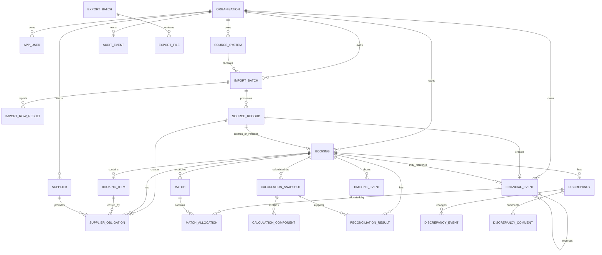

# TripLedger Database Design

**Stage:** 4 - Domain Modeling and Architecture  
**Date:** 13 July 2026  
**Version:** 0.1  
**Status:** Relational design baseline for validation release

## 1. Database Choice

Use a relational transactional database, preferably PostgreSQL for implementation, because TripLedger requires:

- organisation-scoped referential integrity;
- exact financial values;
- idempotent source identity;
- allocation conservation under concurrent writes;
- repeatable migrations, backups, and restore tests.

The Stage 3 SQLite PoCs validate patterns only. Allocation concurrency must be repeated against the selected production database and isolation level.

## 2. Design Rules

1. Every business table has `organisation_id`.
2. Cross-business foreign keys include `organisation_id` where practical.
3. Use exact `numeric` values for money and rates; never binary floating point.
4. Accepted financial events, source records, matches, adjustments, discrepancy resolutions, and audit events are append-only or versioned.
5. Use status columns for lifecycle state, not hard deletion.
6. Use database uniqueness for idempotency and duplicate prevention.
7. Use transactions and row locks for allocation writes.
8. Migrations are versioned and applied through the deployment process.

## 3. ERD

## 4. Core Tables

### organisation

| Column | Type | Constraint |
|---|---|---|
| id | uuid | primary key |
| name | text | not null |
| base_currency | char(3) | not null |
| materiality_threshold | numeric(19,4) | not null |
| default_amount_tolerance | numeric(19,4) | not null |
| default_date_window_before_days | integer | not null |
| default_date_window_after_days | integer | not null |
| rounding_policy_version | text | not null |
| status | text | not null |
| created_at | timestamptz | not null |

### app_user

| Column | Type | Constraint |
|---|---|---|
| id | uuid | primary key |
| organisation_id | uuid | foreign key organisation |
| identity_subject | text | not null |
| display_name | text | not null |
| role | text | not null check supported role |
| status | text | not null |
| created_at | timestamptz | not null |
| deactivated_at | timestamptz | nullable |

Unique:

- `(organisation_id, identity_subject)`

### source_system

| Column | Type | Constraint |
|---|---|---|
| id | uuid | primary key |
| organisation_id | uuid | not null |
| name | text | not null |
| category | text | not null |
| external_code | text | not null |
| time_zone | text | not null |
| active | boolean | not null |

Unique:

- `(organisation_id, external_code)`

### import_batch

| Column | Type | Constraint |
|---|---|---|
| id | uuid | primary key |
| organisation_id | uuid | not null |
| source_system_id | uuid | not null |
| template_type | text | not null |
| template_version | text | not null |
| status | text | not null |
| file_name | text | not null |
| file_checksum | text | not null |
| received_by_user_id | uuid | not null |
| received_at | timestamptz | not null |
| completed_at | timestamptz | nullable |
| failure_code | text | nullable |
| failure_reason | text | nullable |
| total_count | integer | not null default 0 |
| accepted_count | integer | not null default 0 |
| duplicate_count | integer | not null default 0 |
| rejected_count | integer | not null default 0 |
| failed_count | integer | not null default 0 |

Checks:

- `status in ('RECEIVED', 'COMPLETED', 'COMPLETED_WITH_ERRORS', 'FAILED')`
- counts are non-negative and sum to `total_count`
- terminal batches have `completed_at`
- failed batches have `failure_code` and `failure_reason`

### import_row_result

| Column | Type | Constraint |
|---|---|---|
| id | uuid | primary key |
| organisation_id | uuid | not null |
| import_batch_id | uuid | not null |
| row_number | integer | not null |
| outcome | text | not null |
| field_name | text | nullable |
| error_code | text | nullable |
| reason | text | nullable |
| source_record_id | uuid | nullable |
| recorded_at | timestamptz | not null |

Unique:

- `(organisation_id, import_batch_id, row_number)`

Checks:

- `outcome in ('ACCEPTED', 'DUPLICATE', 'REJECTED', 'FAILED')`
- `row_number > 0`
- rejected and failed rows have `error_code` and `reason`

### source_record

| Column | Type | Constraint |
|---|---|---|
| id | uuid | primary key |
| organisation_id | uuid | not null |
| source_system_id | uuid | not null |
| import_batch_id | uuid | not null |
| record_type | text | not null |
| external_record_id | text | not null |
| source_version | text | not null |
| source_row_number | integer | not null |
| content_checksum | text | not null |
| payload_reference | text | nullable |
| accepted_at | timestamptz | not null |

Unique:

- `(organisation_id, source_system_id, record_type, external_record_id, source_version)`

### booking

| Column | Type | Constraint |
|---|---|---|
| id | uuid | primary key |
| organisation_id | uuid | not null |
| source_system_id | uuid | not null |
| external_booking_id | text | not null |
| current_source_record_id | uuid | nullable |
| booking_date | date | not null |
| service_start_date | date | nullable |
| service_end_date | date | nullable |
| lifecycle_status | text | not null |
| selling_currency | char(3) | not null |
| contracted_selling_amount | numeric(19,4) | not null |
| customer_reference | text | nullable |
| created_at | timestamptz | not null |
| updated_at | timestamptz | not null |

Unique:

- `(organisation_id, source_system_id, external_booking_id)`

Checks:

- `service_end_date >= service_start_date` when both exist.
- `lifecycle_status in ('DRAFT', 'CONFIRMED', 'IN_SERVICE', 'COMPLETED', 'CANCELLED')`
- `contracted_selling_amount >= 0`
- `contracted_selling_amount = round(contracted_selling_amount, 2)`
- `selling_currency in ('EUR', 'GBP', 'TRY', 'USD')`

### booking_item

| Column | Type | Constraint |
|---|---|---|
| id | uuid | primary key |
| organisation_id | uuid | not null |
| booking_id | uuid | not null |
| source_record_id | uuid | nullable |
| item_external_id | text | not null |
| service_type | text | not null |
| service_start_date | date | not null |
| service_end_date | date | not null |
| selling_amount | numeric(19,4) | not null |
| selling_currency | char(3) | not null |
| supplier_id | uuid | nullable |
| state | text | not null |
| source_record_id | uuid | nullable |

Checks:

- `service_end_date >= service_start_date`
- `service_type in ('HOTEL', 'TOUR', 'TRANSFER', 'OTHER')`
- `state in ('ACTIVE')`
- `selling_amount >= 0`
- `selling_amount = round(selling_amount, 2)`
- `selling_currency in ('EUR', 'GBP', 'TRY', 'USD')`

Unique:

- `(organisation_id, booking_id, item_external_id)`

### supplier

| Column | Type | Constraint |
|---|---|---|
| id | uuid | primary key |
| organisation_id | uuid | not null |
| name | text | not null |
| external_reference | text | nullable |
| status | text | not null |
| created_at | timestamptz | not null |

Unique:

- `(organisation_id, external_reference)` where `external_reference is not null`

### supplier_obligation

| Column | Type | Constraint |
|---|---|---|
| id | uuid | primary key |
| organisation_id | uuid | not null |
| booking_id | uuid | nullable |
| booking_item_id | uuid | nullable |
| supplier_id | uuid | nullable |
| source_record_id | uuid | nullable |
| amount | numeric(19,4) | not null |
| currency | char(3) | not null |
| due_date | date | nullable |
| status | text | not null |
| created_at | timestamptz | not null |

Checks:

- `amount > 0`
- `amount = round(amount, 2)`
- `currency in ('EUR', 'GBP', 'TRY', 'USD')`
- booking and booking item references, when present, must belong to same organisation.

Unique:

- `(organisation_id, source_record_id)` where `source_record_id is not null`

### financial_event

| Column | Type | Constraint |
|---|---|---|
| id | uuid | primary key |
| organisation_id | uuid | not null |
| source_record_id | uuid | nullable |
| booking_id | uuid | nullable |
| event_type | text | not null |
| direction | text | not null |
| amount | numeric(19,4) | not null |
| currency | char(3) | not null |
| effective_at | timestamptz | not null |
| external_reference | text | nullable |
| reverses_event_id | uuid | nullable |
| adjustment_reason | text | nullable |
| created_by_user_id | uuid | nullable |
| created_at | timestamptz | not null |

Unique:

- `(organisation_id, source_record_id)` where `source_record_id is not null`
- `(organisation_id, reverses_event_id)` where `reverses_event_id is not null`

Checks:

- `amount > 0` for canonical stored amount; direction/event type controls effect.
- `amount = round(amount, 2)`
- `currency in ('EUR', 'GBP', 'TRY', 'USD')`
- `adjustment_reason is not null` for manual adjustments.
- `APPROVED_DISCOUNT` is supported for booking economics reductions.

Immutability:

- Application does not expose update/delete.
- `V7__financial_event_import.sql` adds database triggers that reject update and delete operations on accepted financial events.
- `V8__financial_event_reversal_path.sql` adds reversal type support and prevents multiple reversals for one original event.
- `V9__money_currency_precision.sql` adds database checks for the validation-release supported currency set and two-decimal minor-unit precision.

### exchange_rate

| Column | Type | Constraint |
|---|---|---|
| id | uuid | primary key |
| organisation_id | uuid | not null |
| financial_event_id | uuid | nullable |
| source_amount | numeric(19,4) | not null |
| source_currency | char(3) | not null |
| target_amount | numeric(19,4) | not null |
| target_currency | char(3) | not null |
| rate | numeric(28,12) | not null |
| effective_at | timestamptz | not null |
| rate_source | text | not null |
| rounding_policy_version | text | not null |
| created_by_user_id | uuid | nullable |
| created_at | timestamptz | not null |

Check:

- `rate > 0`
- `source_currency` and `target_currency` are supported validation-release currencies and differ.
- `source_amount` and `target_amount` are positive two-decimal money values.
- `rate` uses no more than 12 fractional digits.

Notes:

- `target_amount` is the persisted rounded result of `source_amount * rate`.
- `financial_event_id`, when present, links the evidence to the converted financial event.
- `V10__exchange_rate_evidence.sql` adds persisted exchange-rate evidence for VR-014.

### calculation_snapshot

| Column | Type | Constraint |
|---|---|---|
| id | uuid | primary key |
| organisation_id | uuid | not null |
| booking_id | uuid | not null |
| rule_version | text | not null |
| contracted_gross_sale | numeric(19,4) | nullable |
| expected_customer_receivable | numeric(19,4) | nullable |
| expected_deductions | numeric(19,4) | nullable |
| active_supplier_cost | numeric(19,4) | nullable |
| estimated_gross_margin | numeric(19,4) | nullable |
| currency | char(3) | nullable |
| status | text | not null |
| unknown_components | text | not null default '[]' |
| created_at | timestamptz | not null |

Implementation note:

- `V11__booking_economics_snapshot.sql` creates `calculation_snapshot` for VR-015. The current implementation stores unknown component names as text containing a JSON array shape until VR-016 adds richer explanation components.

### calculation_component

| Column | Type | Constraint |
|---|---|---|
| id | uuid | primary key |
| organisation_id | uuid | not null |
| calculation_snapshot_id | uuid | not null |
| component_type | text | not null |
| source_table | text | not null |
| source_id | uuid | not null |
| amount | numeric(19,4) | nullable |
| currency | char(3) | nullable |
| exchange_rate_id | uuid | nullable |
| formula_reference | text | not null |

### match

| Column | Type | Constraint |
|---|---|---|
| id | uuid | primary key |
| organisation_id | uuid | not null |
| booking_id | uuid | not null |
| match_type | text | not null |
| rule_code | text | nullable |
| status | text | not null |
| created_by_user_id | uuid | nullable |
| created_at | timestamptz | not null |
| removed_at | timestamptz | nullable |
| reason | text | nullable |

### match_allocation

| Column | Type | Constraint |
|---|---|---|
| id | uuid | primary key |
| organisation_id | uuid | not null |
| match_id | uuid | not null |
| financial_event_id | uuid | not null |
| amount | numeric(19,4) | not null |
| currency | char(3) | not null |
| active | boolean | not null default true |

Checks:

- `amount > 0`

Concurrency rule:

- Allocation writes lock the related `financial_event` row.
- Within the transaction, active allocation sum for the event must be less than or equal to available event amount.

### reconciliation_result

| Column | Type | Constraint |
|---|---|---|
| id | uuid | primary key |
| organisation_id | uuid | not null |
| booking_id | uuid | not null |
| calculation_snapshot_id | uuid | not null |
| rule_version | text | not null |
| status | text | not null |
| variance_amount | numeric(19,4) | nullable |
| variance_currency | char(3) | nullable |
| created_at | timestamptz | not null |
| superseded_at | timestamptz | nullable |

Index:

- `(organisation_id, booking_id, superseded_at)` for current result lookup.

### discrepancy

| Column | Type | Constraint |
|---|---|---|
| id | uuid | primary key |
| organisation_id | uuid | not null |
| booking_id | uuid | nullable |
| type | text | not null |
| severity | text | not null |
| component | text | nullable |
| cause_identity | text | not null |
| amount | numeric(19,4) | nullable |
| currency | char(3) | nullable |
| status | text | not null |
| owner_user_id | uuid | nullable |
| explanation | text | not null |
| created_at | timestamptz | not null |
| resolved_at | timestamptz | nullable |

Unique partial index:

- `(organisation_id, booking_id, type, component, cause_identity)` where status is active.

### audit_event

| Column | Type | Constraint |
|---|---|---|
| id | uuid | primary key |
| organisation_id | uuid | nullable for system startup events |
| actor_user_id | uuid | nullable |
| system_actor | text | nullable |
| action | text | not null |
| target_type | text | not null |
| target_id | uuid | nullable |
| outcome | text | not null |
| before_reference | text | nullable |
| after_reference | text | nullable |
| reason | text | nullable |
| correlation_id | text | not null |
| created_at | timestamptz | not null |

Append-only:

- No application update/delete path.
- Restrict database grants for normal application role.

### export_batch

| Column | Type | Constraint |
|---|---|---|
| id | uuid | primary key |
| organisation_id | uuid | not null |
| requested_by_user_id | uuid | not null |
| export_type | text | not null |
| format_version | text | not null |
| filters_json | jsonb | not null |
| status | text | not null |
| row_count | integer | nullable |
| checksum | text | nullable |
| created_at | timestamptz | not null |
| completed_at | timestamptz | nullable |

## 5. Indexing Strategy

Validation release indexes:

- source idempotency: `source_record(organisation_id, source_system_id, record_type, external_record_id, source_version)`;
- booking lookup: `booking(organisation_id, source_system_id, external_booking_id)`;
- financial candidate search: `financial_event(organisation_id, booking_id, event_type, currency, effective_at)`;
- unmatched events: `financial_event(organisation_id, booking_id) where booking_id is null`;
- discrepancy queue: `discrepancy(organisation_id, status, type, severity, created_at)`;
- current reconciliation: `reconciliation_result(organisation_id, booking_id) where superseded_at is null`;
- audit/timeline: `audit_event(organisation_id, target_type, target_id, created_at)`.

Additional performance indexes require measured query plans against the reference dataset.

## 6. Migration and Restore

- All schema changes use versioned migrations.
- Migrations must be repeatable in a clean local environment.
- Destructive migrations require backup/restore evidence and an ADR when they affect low-reversibility records.
- Backup manifest records database dump timestamp, schema version, row counts for critical tables, and checksum.
- Restore validation checks counts for booking, financial event, match, discrepancy, and audit tables.
