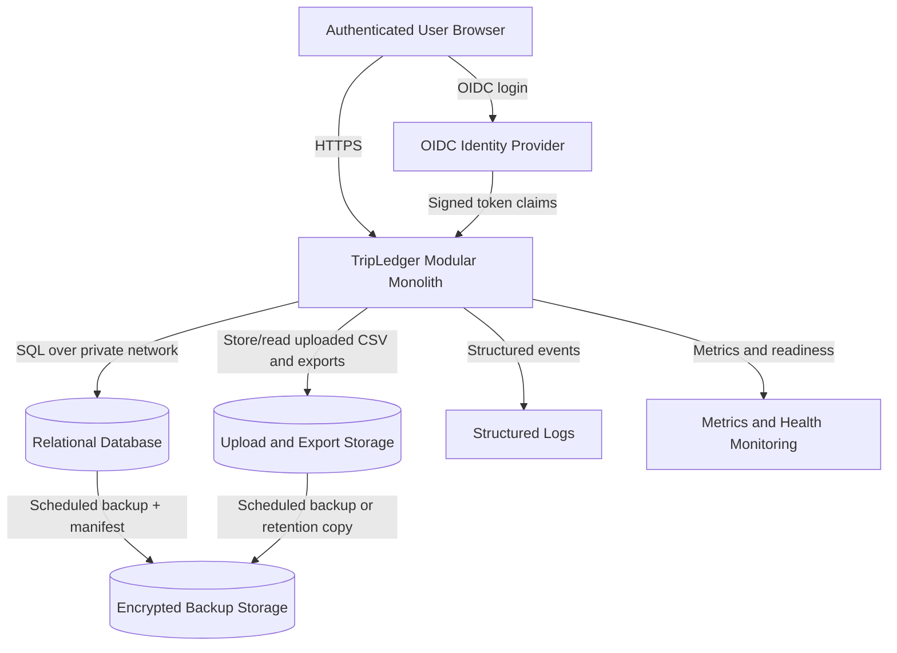

# TripLedger Deployment Diagram

**Stage:** 4 - Domain Modeling and Architecture  
**Date:** 13 July 2026  
**Version:** 0.1  
**Status:** Deployment baseline for validation release

## 1. Deployment Principle

The validation release uses the simplest production-like topology that proves security, data integrity, recovery, and observability.

No Kubernetes, Kafka, service mesh, multi-region active-active deployment, or microservices are required.

## 2. Production-like Pilot Topology



## 3. Runtime Components

| Component | Responsibility | First-release requirement |
|---|---|---|
| Browser client | User interface | No secrets, no authority decisions |
| TripLedger application | API, domain modules, background jobs, health checks | One deployable application |
| OIDC identity provider | Authentication, passwords, MFA | Mature provider; standard OIDC claims |
| Relational database | Canonical state, financial records, audit, jobs | Transactional, backed up, migration-controlled |
| Object/file storage | Uploaded files and generated exports | Non-executable path, retention controlled |
| Logs and metrics | Diagnosis and operational evidence | Correlation id, no restricted data |
| Backup storage | Recovery evidence | Encrypted, access-controlled, restore tested |

## 4. Local Development Topology

```text
Developer machine
    Docker Compose
        TripLedger application container
        PostgreSQL database container
        Maven verification container
    Synthetic acceptance fixtures
```

Goal: a new developer can start the documented environment within 30 minutes excluding initial software downloads.

Local environment is configured from `.env.example` copied to `.env`. The template contains only safe placeholders. Local deployment smoke evidence is produced with `make smoke`, which checks application and Actuator liveness/readiness endpoints.

## 5. Environments

| Environment | Data | Purpose |
|---|---|---|
| Local | synthetic fixtures | Development and automated tests |
| CI | synthetic fixtures | Tests, scans, migrations |
| Demo | synthetic/anonymised data only | Portfolio and validation demonstration |
| Pilot | real data only after gates | Controlled customer validation |

No real personal or confidential customer data enters local, CI, or public demo environments.

## 6. Deployment Flow

```text
Commit
 -> automated tests
 -> static checks
 -> dependency and secret scans
 -> build application artifact
 -> run database migration verification
 -> deploy to target environment
 -> run readiness and smoke checks
 -> record deployment evidence
```

Validation-release deployment evidence records:

- commit sha;
- environment name;
- operator;
- timestamp;
- configuration source, without secret values;
- `make verify` result;
- smoke-check result;
- liveness and readiness endpoint results;
- migration version;
- rollback decision or previous known-good commit.

Required environment values:

| Value | Local source | Production-like source |
|---|---|---|
| HTTP port | `.env` `APP_PORT` | platform routing or service config |
| Database URL | Compose service default | deployment environment secret/config |
| Database username | `.env` `POSTGRES_USER` | secret manager |
| Database password | `.env` `POSTGRES_PASSWORD` | secret manager |
| Allowed origins | `.env` `TRIPLEDGER_ALLOWED_ORIGINS` | deployment config |
| Log level | `.env` `TRIPLEDGER_LOG_LEVEL` | deployment config |

Rollback rule:

- application-only failure rolls back to the previous known-good application version;
- migration failure in local may reset volumes, but shared or pilot environments must restore from backup or fix forward with a new migration;
- Flyway history must not be edited manually.

## 7. Backup and Restore

Minimum pilot targets:

- Recovery point objective: backup no older than 24 hours.
- Recovery time objective: restore within 4 hours for reference pilot dataset.

Backup manifest includes:

- environment;
- timestamp;
- application version;
- schema version;
- critical table counts;
- checksum;
- storage object count where applicable.

Restore verification checks:

- application readiness;
- booking count;
- financial event count;
- match count;
- discrepancy count;
- audit event count;
- sample booking timeline reconstruction.

## 8. Operational Health

Liveness:

- process is running.

Readiness:

- database reachable;
- migrations current;
- object storage reachable;
- identity-provider configuration loaded;
- background job queue available.

Metrics:

- import counts and failures;
- reconciliation duration;
- match counts;
- discrepancy counts;
- export failures;
- authentication failures;
- job retries;
- request duration by endpoint;
- error counts by stable code.

## 9. Scaling Position

The first response to pilot growth is to scale the whole application and database vertically or with simple stateless application replicas if needed.

A module split may be reconsidered only when:

- one workload has materially different scale characteristics;
- independent release cadence is genuinely required;
- separate teams own separate domains;
- data ownership can tolerate distributed consistency;
- cross-service tracing and operational controls are mature.
